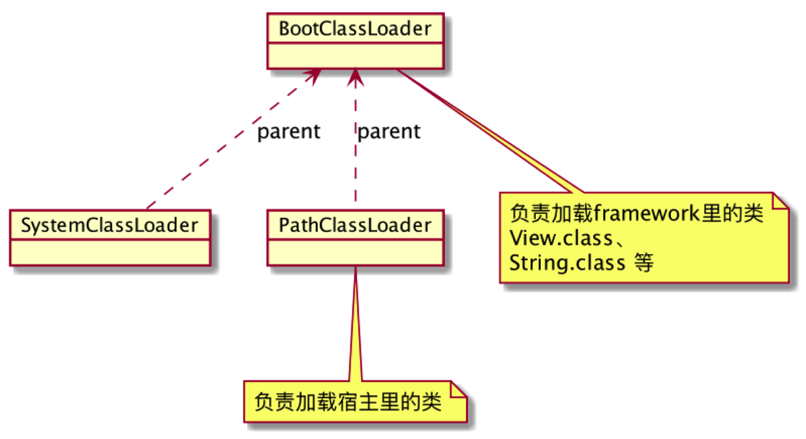

- MyApplication.class.getClassLoader
    - dalvik.system.PathClassLoader[/data/app/com.test.apk]
- Application.class.getClassLoader
    - java.lang.BootClassLoader@410fbd18
- Context.getClassLoader和Class.getClassLoader的区别
    - Context.getClassLoader 获取加载apk的ClassLoader
    - Class.getClassLoader 获取加载当前Class的ClassLoader



